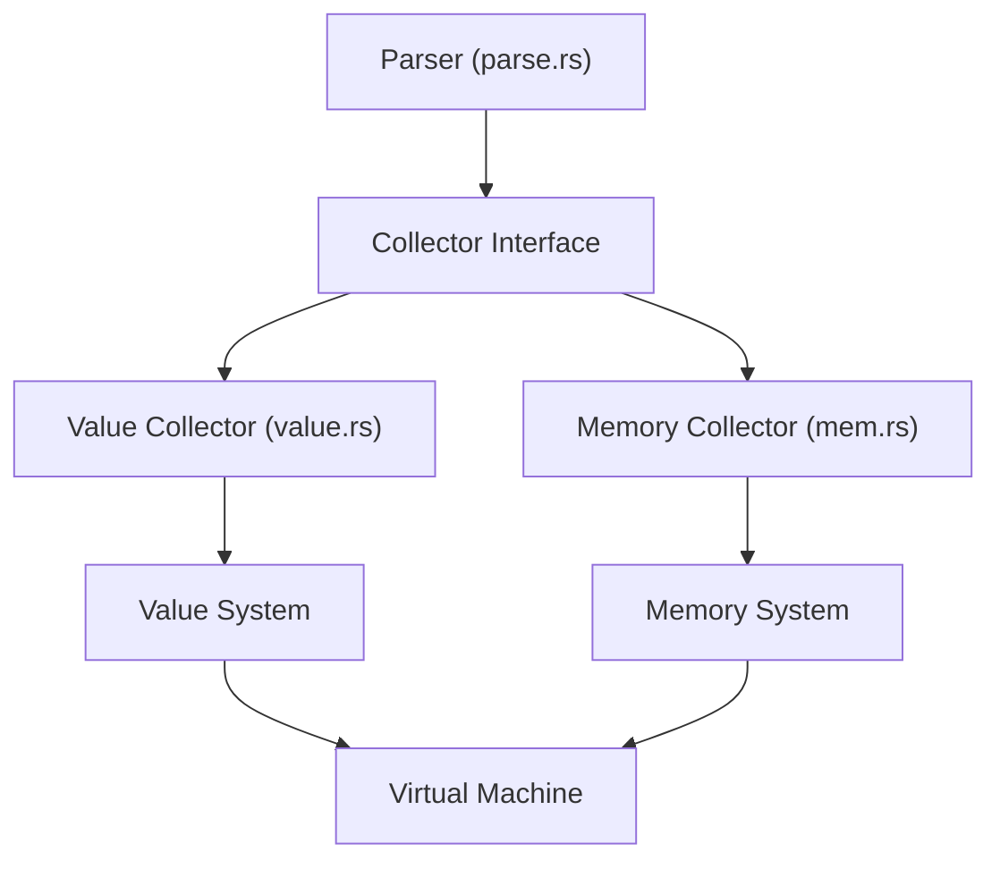

# System Patterns

## System Architecture

Rebel is built with a layered architecture that separates concerns and provides a clean abstraction model:



### Core Components

1. **Parser**: Processes input text into tokens according to REBOL-like syntax rules
2. **Collector Interface**: Abstraction that receives parser events for building data structures
3. **Value System**: High-level representation of Rebel values (strings, words, blocks, etc.)
4. **Memory System**: Low-level memory management, allocation, and garbage collection
5. **Virtual Machine**: Executes Rebel code (under development)

## Key Technical Decisions

### 1. Rust as Implementation Language

Rust was chosen for its memory safety without garbage collection, performance, and robust type system. These characteristics align well with the goals of creating a reliable, efficient VM.

### 2. Parsing Strategy

The parser adopts a streaming approach where it processes input sequentially and emits events to a collector, rather than building an abstract syntax tree. This:
- Allows memory-efficient parsing
- Enables different backends (in-memory values, VM bytecode, etc.)
- Separates syntax parsing from semantic interpretation

### 3. Memory Management

Memory is managed using a custom heap allocator with:
- Tagged value representation for efficient type checking
- Word-aligned memory access for performance
- Slice abstractions for safe memory operations
- Stack-based collection for nested structures

### 4. Value Representation

Values are represented in two distinct ways:
- High-level `Value` enum for convenient Rust code manipulation
- Low-level `MemValue` for efficient storage in the VM

## Design Patterns

### 1. Collector Pattern

The Parser uses a collector interface to decouple parsing from representation:

```rust
pub trait Collector {
    type Error;
    fn string(&mut self, string: &str) -> Option<()>;
    fn word(&mut self, kind: WordKind, word: &str) -> Option<()>;
    fn integer(&mut self, value: i32) -> Option<()>;
    fn begin_block(&mut self) -> Option<()>;
    fn end_block(&mut self) -> Option<()>;
    fn begin_path(&mut self) -> Option<()>;
    fn end_path(&mut self) -> Option<()>;
}
```

This pattern:
- Enables multiple backends without changing the parser
- Supports different memory models and execution strategies
- Follows the Visitor pattern from OOP design patterns

### 2. Tagged Union for Values

Both `Value` and `MemValue` use tagged unions to efficiently represent different value types with minimal memory overhead.

### 3. Builder Pattern

The `ValueCollector` implements a builder pattern to construct complex nested values from sequential parser events.

### 4. Slice Abstraction

Custom `Slice` and `SliceMut` types provide safe, abstracted access to underlying memory:

```rust
pub struct Slice<'a, I: Item>(&'a [u8], PhantomData<I>);
pub struct SliceMut<'a, I: Item>(&'a mut [u8], PhantomData<I>);
```

## Component Relationships

### Parser and Collectors

The Parser produces a stream of events (string found, word found, block start, etc.) that are consumed by a Collector implementation. Two main collectors exist:

1. **ValueCollector**: Builds an in-memory `Value` tree for evaluation or manipulation in Rust
2. **ParseCollector**: Builds low-level memory representations for the VM

### Memory and Value Systems

The memory system provides the foundation for the value system:
- Low-level byte-oriented storage with types like `Slice`, `Stack`, and `Heap`
- `MemValue` as efficient representation combining tag and data
- Memory operations like allocation, stack management, and serialization

The value system builds on this with:
- High-level `Value` enum for Rust code manipulation
- Methods to convert between `Value` and `MemValue`
- Operations to construct, query, and transform values
